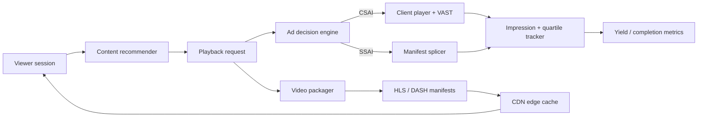

# Media Systems Lab

**Three runnable systems projects that model the core engineering loops behind ad-supported streaming: ad decisioning + insertion, adaptive video delivery, and personalized content recommendation.**

> Everything in this lab runs on deterministic synthetic data and local files. It demonstrates the systems boundaries and algorithms without pretending to be connected to production ad servers, CDN traffic, or proprietary viewer data.

[](https://github.com/mneha05/mneha05/actions/workflows/media-systems-lab.yml)

## The three systems

| Project | What it demonstrates | Keywords |
|---|---|---|
| [`avod-engine`](avod-engine/) | CPM-aware ad decisioning, targeting, frequency caps, VAST parsing, impression/quartile tracking, CSAI payloads, HLS SSAI splicing | **AVOD, programmatic advertising, CSAI, SSAI, VAST, CPM, ad server adapters, impression tracking** |
| [`stream-delivery`](stream-delivery/) | HLS + DASH packaging, ABR selection, live playlist windows, FFmpeg transcode planning, CDN edge-cache simulation | **HLS, MPEG-DASH, transcoding, live ingest, ABR, CDN, cache hit rate, origin offload** |
| [`content-recs`](content-recs/) | Two-stage candidate generation, hybrid collaborative/content ranking, cold start, diversity reranking, offline metrics | **recommendation systems, personalization, ranking, candidate generation, Recall@K, NDCG@K** |

## End-to-end picture



## Run everything

Requires Python 3.10+ and **no third-party runtime packages**.

```bash
cd media-systems-lab
bash scripts/run_all_tests.sh

python avod-engine/demo.py
python stream-delivery/demo.py
python content-recs/demo.py
```

## Why it is structured this way

The goal is not three toy notebooks. Each directory owns a clean systems boundary:

- **AVOD engine** separates decisioning, vendor adapters, VAST parsing, insertion, and measurement.
- **Streaming delivery** separates packaging, live-window state, CDN behavior, and ABR logic.
- **Recommendation system** separates candidate generation, ranking, diversity, and evaluation.

That makes the code easy to discuss in an interview: each component can be swapped for a production implementation without rewriting the whole project.

## Engineering boundary

This repository intentionally does **not** claim:

- a live FreeWheel or Google Ad Manager account;
- production viewer data or ad inventory;
- a production CDN;
- proprietary recommendation models;
- measured revenue lift on real users.

The ad-provider classes are explicit integration adapters that normalize request shapes into the local engine. The streaming project generates standards-shaped manifests and executable FFmpeg command plans. The recommender evaluates against deterministic synthetic viewing histories.
