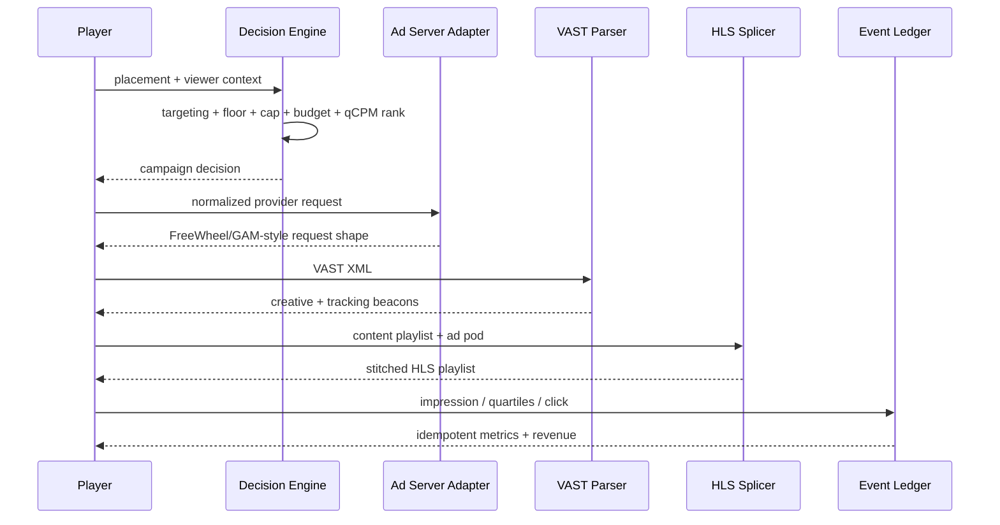

# AVOD Engine

**A compact ad-tech backend for an ad-supported streaming service.** It models the path from an ad opportunity to a monetized, measurable impression without requiring vendor credentials.

## What is implemented



### 1. Programmatic-style decisioning

`avod/decision.py` filters campaigns by:

- geography, device, and content genre targeting;
- CPM floor;
- remaining budget;
- per-user frequency cap.

Eligible campaigns are ranked by a **quality-adjusted CPM**:

```text
qCPM = bid_CPM × (0.65 + 0.35 × predicted_completion_rate) × pacing_multiplier
```

The score keeps CPM as the economic signal while demonstrating where a real platform can inject completion prediction or pacing.

### 2. Ad-server integration boundary

`avod/adapters.py` contains vendor-shaped adapters for **FreeWheel-style** and **Google Ad Manager-style** request contracts. They intentionally build normalized request payloads rather than claiming a live authenticated vendor integration.

### 3. VAST + measurement

`avod/vast.py` parses a VAST document into:

- media URL;
- duration;
- impression beacon;
- quartile/completion tracking URLs;
- click-through URL.

`avod/tracking.py` records idempotent events and computes impressions, completions, clicks, CTR, completion rate, and revenue from CPM.

### 4. CSAI + SSAI

- **CSAI:** `csai_payload()` emits the creative URL plus the beacon map a player needs to fire.
- **SSAI:** `splice_hls()` inserts ad segments into an HLS media playlist with discontinuity boundaries and an explicit ad-break marker.

## Run it

```bash
cd avod-engine
python demo.py
python -m unittest discover -s tests -v
```

Sample demo output includes the winning campaign, provider request shape, parsed VAST metadata, stitched HLS playlist, and aggregate ad metrics.

## Production extensions

Natural next steps are Redis-backed frequency caps, budget reservations with transactional settlement on impression, a real ad-server HTTP client, OpenRTB/VAST validation, Kafka event ingestion, and warehouse-backed yield reporting.
