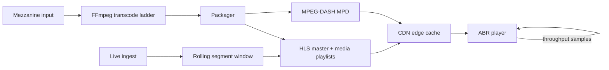

# Stream Delivery Lab

**A dependency-free streaming infrastructure simulator for packaging, adaptive bitrate selection, live manifests, transcoding plans, and CDN behavior.**

## Pipeline



## Implemented pieces

### HLS + DASH packaging

`streamlab/packager.py` generates:

- an HLS master playlist with a bitrate/resolution ladder;
- VOD media playlists;
- a DASH MPD with `Representation` and `SegmentTemplate` entries;
- executable FFmpeg command plans for H.264/AAC renditions.

If FFmpeg is installed, the generated commands can be executed directly. The tests do not require FFmpeg.

### Adaptive bitrate selection

`streamlab/abr.py` uses the harmonic mean of recent throughput measurements plus a safety margin. It selects the highest rendition that fits the safe bandwidth estimate and falls back to the lowest rendition during startup.

### Live stream window

`streamlab/live.py` maintains a rolling HLS window, increments `EXT-X-MEDIA-SEQUENCE`, and never emits `EXT-X-ENDLIST`, matching the state shape needed for continuous ingest.

### CDN simulation

`streamlab/cdn.py` implements a byte-capacity LRU edge cache and reports:

- request hit rate;
- byte hit rate;
- origin bytes;
- edge-served bytes;
- evictions.

That makes origin offload measurable instead of describing a CDN only at the architecture-diagram level.

## Run

```bash
cd stream-delivery
python demo.py
python -m unittest discover -s tests -v
```

## Production extensions

A production version would connect the packager to real media probes, use CMAF/fMP4, LL-HLS or DASH-LL, emit CDN cache-control headers, ingest real player telemetry, and evaluate rebuffer ratio, startup delay, average bitrate, and CDN egress cost.
