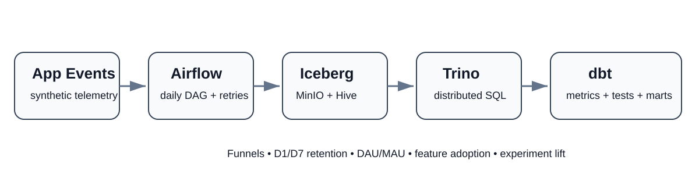

<p align="center"></p>

# ProductPulse — Product Analytics Data Platform

**A Meta-style product analytics pipeline built around event telemetry, Trino, dbt, Airflow, Iceberg, Hive Metastore, and object storage.**

ProductPulse answers the questions a product data engineer gets asked after a new feature launch: *Did people adopt it? Where does the funnel break? Did treatment move conversion? Are users coming back on D1/D7?* The project separates ingestion, storage, transformation, orchestration, and product metrics so each layer can fail, retry, and evolve independently.

## What is actually implemented

- **Synthetic event generator** producing deterministic app telemetry with users, sessions, country/platform dimensions, A/B assignment, duplicate retries, and a late-arriving event.
- **Iceberg table design** partitioned by event date, backed by **MinIO** object storage and a **Hive Metastore**.
- **Trino** as the SQL query engine over the Iceberg catalog.
- **dbt-trino** models for staging/deduplication, sessions, DAU/MAU, feature adoption, funnels, D1/D7 retention, and experiment conversion.
- **Incremental dbt staging** with a 2-day lookback so late events are reprocessed without rebuilding all history.
- **Airflow DAG** that generates telemetry, loads it into Iceberg, then runs `dbt build`; retries are safe because `event_id` is the dedupe key.
- **Data-quality tests** for uniqueness, non-null identifiers, accepted event names, and model grain.
- **Pure-Python metric oracle + 7 unit tests** so the core product metrics can be checked without Docker.

## Why the design is useful

```text
producer retries / late events
            ↓
      raw Iceberg table
            ↓
 incremental dedupe in dbt
            ↓
 sessions + product marts
            ↓
DAU/MAU | funnel | retention | experiment lift
```

The important part is not the dashboard. It is making the metric layer **reproducible and retry-safe**. Raw events are append-only; deduplication happens by `event_id`; incremental models deliberately revisit recent partitions to absorb late arrivals; and dbt tests guard the expected grain.

## Run the fast path

No third-party Python packages are required for the generator/tests:

```bash
cd productpulse
bash scripts/run_tests.sh
```

That runs 7 tests, generates deterministic telemetry, and prints funnel, retention, and experiment metrics.

## Run the full stack

Requirements: Docker + Docker Compose.

```bash
docker compose up -d
```

Services:

| Service | Purpose | Port |
|---|---|---:|
| MinIO | S3-compatible Iceberg warehouse | 9000 / 9001 |
| Hive Metastore | Iceberg catalog metadata | 9083 |
| Trino | SQL engine | 8080 |
| Airflow | orchestration UI / scheduler | 8088 |

Airflow's `productpulse_daily` DAG runs:

```text
generate_events → load_to_iceberg → dbt_build
```

## dbt model graph

```text
iceberg.productpulse.raw_events
            ↓
       stg_events          ← incremental + dedupe + late-event lookback
            ↓
       int_sessions
            ↓
 ┌──────────┼──────────────┬─────────────────┐
 ↓          ↓              ↓                 ↓
daily     funnel       retention         experiment
metrics   metrics       cohorts           metrics
```

## Product questions answered

- **DAU / MAU and stickiness** — daily active users and a rolling 30-day active base.
- **Feature adoption** — distinct feature users / DAU.
- **Funnel** — app open → feature view → like → share.
- **Retention** — cohort-based D1 and D7 return rates.
- **Experimentation** — treatment/control conversion rates, with a Python oracle also reporting absolute lift, relative lift, and z-score.
- **Session behavior** — session duration, event count, and whether the launched feature was used.

## Files worth reading

| Path | Why it matters |
|---|---|
| `generator/generate_events.py` | deterministic event producer with duplicates + late data |
| `airflow/dags/productpulse_pipeline.py` | orchestration and retry boundary |
| `trino/catalog/iceberg.properties` | Trino ↔ Iceberg ↔ Hive ↔ MinIO integration |
| `dbt/models/staging/stg_events.sql` | incremental dedupe / late-arrival strategy |
| `dbt/models/marts/` | product analytics SQL |
| `analytics/oracle.py` | independent metric implementation for verification |
| `tests/test_pipeline.py` | invariants and experiment sanity checks |

## Engineering boundary

This is a **local portfolio implementation**, not a claim of operating Meta's internal stack or production-scale traffic. Docker reproduces the interfaces and failure boundaries on one machine; the event generator uses synthetic telemetry. The goal is to make Trino/dbt/Airflow/Iceberg/Hive and product-analytics work inspectable rather than name-dropping tools.

## Resume-ready scope

`Python` · `SQL` · `Trino` · `dbt` · `Airflow` · `Apache Iceberg` · `Hive Metastore` · `MinIO / S3` · `incremental ETL` · `late-arriving data` · `deduplication` · `product analytics` · `funnels` · `retention cohorts` · `A/B experiments`
